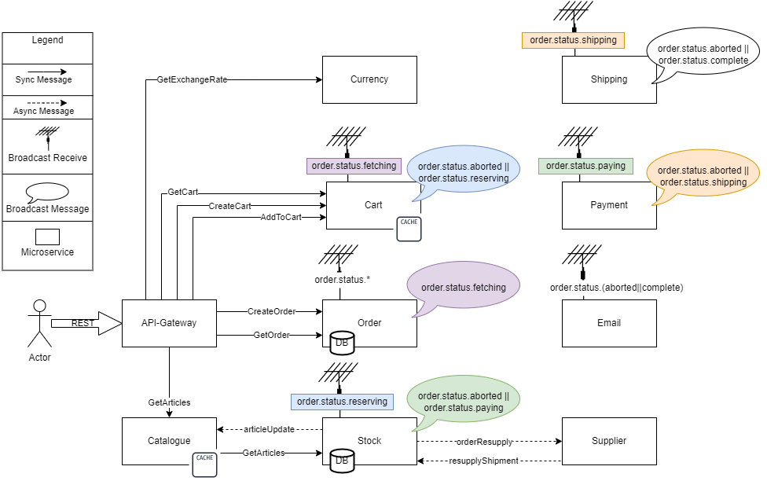

# Errorhandling in a Microservice Architecture

[](https://github.com/Tobias-Pe/Microservices-Errorhandling/blob/main/LICENSE)
[](https://gitmoji.dev)


The application is a Demo-Webshop, where 10 Services communicate using synchronous and asynchronous communication.

The aim of the application is to implement various error handling methods, try them out and measure their effectiveness
under pressure of load tests.

_This project is part of a Bachelorthesis in Computer Science🎓_

## Overview Architecture 🏗️



## API Reference 👀

#### Get all articles 🛍️

```http
  GET /articles/${category}
```

| Parameter  | Type     | Description                                               |
|:-----------|:---------|:----------------------------------------------------------|
| `category` | `string` | **Optional**. Filter the articles for a certain category. |

#### Get an exchange rate 💰

```http
  GET /exchange/${currency}
```

| Parameter  | Type     | Description                                                    |
|:-----------|:---------|:---------------------------------------------------------------|
| `currency` | `string` | **Required**. Currently supported: USD,GBP,INR,CAS,JPY,SEK,PLN |

Mocks an exchange from ${currency} to €

#### Create a shopping cart 🛒

```http
  POST /cart
```

| JSON-Body    | Type     | Description                                                         |
|:-------------|:---------|:--------------------------------------------------------------------|
| `article_id` | `string` | **Required**. Will create a cart with this article_id already in it |

Returns the new carts ID.

#### Add articles to a shopping cart 🛒

```http
  PUT /cart/${id}
```

| Parameter | Type     | Description                        |
|:----------|:---------|:-----------------------------------|
| `id`      | `string` | **Required**. The ID of your cart. |

| JSON-Body    | Type     | Description                                                      |
|:-------------|:---------|:-----------------------------------------------------------------|
| `article_id` | `string` | **Required**. The ID of the article you want to add to the cart. |

#### Get a cart's content 🛒

```http
  GET /cart/${id}
```

| Parameter | Type     | Description                                |
|:----------|:---------|:-------------------------------------------|
| `id`      | `string` | **Required**. The ID of your created cart. |

#### Create an order 🧾

```http
  POST /order
```

| JSON-Body    | Type     | Description  |
|:-------------|:---------|:-------------|
| `cartId`     | `string` | **Required** |
| `name`       | `string` | **Required** |
| `address`    | `string` | **Required** |
| `creditCard` | `string` | **Required** |
| `email`      | `string` | **Required** |

Creates an order, that will be validated and shipped in the background.

#### Get an order's content 🧾

```http
  GET /order/${id}
```

| Parameter | Type     | Description                                 |
|:----------|:---------|:--------------------------------------------|
| `id`      | `string` | **Required**. The ID of your created order. |

Look at the current status of your order.

## Tech Stack 📚

**Order & Stock:** MongoDB with ACID-Transactions

**Cart:** Redis

**API-Gateway:** gin-gonic/gin

**Synchronous Communication:** GRPC

**Asynchronous Communication:** RabbitMQ

**Load Balancing:** NGINX with Docker DNS

**Load Testing:** Locust

**TSDB Metrics** Prometheus

**TSDB Logs** InfluxDB

**Monitoring Dashboard** Grafana

**Metrics-Exporter:** cAdvisor (Containers), Node Exporter (Hardware) _(To make these docker swarm compatible, some configurations were orientated on https://github.com/stefanprodan/swarmprom)_

## Errorhandling Methods 🧯

These are the used errorhandling methods to make the application more resilient:

- Saga-Pattern: 
  - Order Transaction-Chain
- Retry-Mechanism with Backoff-Algorithm: 
  - All asynchronous Services
- Stateless Services: 
  - All Services are stateless (only metrics data is stored in memory)
- Redundancy:
  - Round Robin Loadbalancing using Docker's DNS-Server
  - Service replication using Compose
- Bulkheads: 
  - Stock Service was split into two Services to separate Order-Duties and Catalogue-Duties
  - Limits inside Compose-File
- Circuit Breakers: 
  - 4 Circuit Breakers inside each API-Gateway Instance
- Adaptive Timeouts:
  - Moving Average for every request-type inside API-Gateway's request-handlers

_Configuration for some methods can be made under config/docker.env_

## Analysis of the Demo-Application 🧪

The locust load tests were launched using docker on a single pc, using 5 worker container and a manager container.

The Demo-Application was started using the docker-swarm.yml on a Docker-Swarm-Cluster of 5 Raspberry Pi 4 Model B Rev 1.1, running Ubuntu 20.04.3 LTS.

All 6 computers are connected via a Gbit-Ethernet Switch.

_All images for this application are build for amd64 and arm64._

Inside this Test-Setup the following Testdata was collected:

- [Testrun1 - Basic Application](./test/results/Testrun1-BasicApplication)
- [Testrun2 - Improve Resource Usage](./test/results/Testrun2-ManualDistribution)
- [Testrun3 - Establish a Bulkhead](./test/results/Testrun3-AddedCatalogue)
- [Testrun4 - Usage of Circuit Breakers](./test/results/Testrun4-CircuitBreaker)
- [Testrun5 - Adaptive Timeouts](./test/results/Testrun5-AdaptiveTimeouts)

## Run Locally 🏃

Clone the project

```bash
  git clone https://github.com/Tobias-Pe/Microservices-Errorhandling
```

Go to the project directory

```bash
  cd Microservices-Errorhandling
```

Start all containers with compose

```bash
  docker-compose up
```

_PS: there are some run configurations (generated with GoLand) in the .run folder_

## Deployment 🚀

Init manager node for cluster
```bash
  docker swarm init
```

On worker nodes paste command from output of ``init`` command 
```bash
  docker swarm join ...
```

Deploy stack onto swarm cluster on manager node
```bash
  docker stack deploy --compose-file docker-swarm.yml app
```

Optional steps:

[Visualizer for Docker-Swarm](https://github.com/dockersamples/docker-swarm-visualizer):
```bash
  docker service create \
  --name=viz \
  --publish=8080:8080/tcp \
  --constraint=node.role==manager \
  --mount=type=bind,src=/var/run/docker.sock,dst=/var/run/docker.sock \
  alexellis2/visualizer-arm:latest
```

[Config docker to publish metrics](https://docs.docker.com/config/daemon/prometheus/#configure-docker)

## Known Issues 🦺

#### Circuit Breaker Statechange is not displayed on Dashboard ?

If the Circuit Breaker recovers from the open state faster than Prometheus can scrape the metrics of it, then Prometheus will not observe a change in the Circuit Breaker state. 

#### Exceptions in Locust Testrun ?

The Nginx-Server will abort connections if there are too many.   
Feel free to play around with the configuration of it, if you'd need [more concurrent connections](https://nginx.org/en/docs/ngx_core_module.html#worker_connections).

#### Metric is not shown or zero on manual tests ?

Some metrics, which can not be initialized to Zero at launch (e.g. all API-Service Webserver Requests with all possible outcomes can not be initialized at launch), 
will not show up in Grafana the first time such a metric will be recorded. 

The reason behind it is that, when the metric is increased or set, it will be initialised to zero and then instantly changed.  
This change from 0 to X will very probably not be recorded by Prometheus separately (current scrape intervall 5 Sec).  
Therefore, if the dashboard panel uses the increase() query, it will think there is no increase from 0 to X.


## Author ✍️

[@Tobias Peslalz](https://github.com/Tobias-Pe)

[](https://www.linkedin.com/in/tobias-peslalz)
